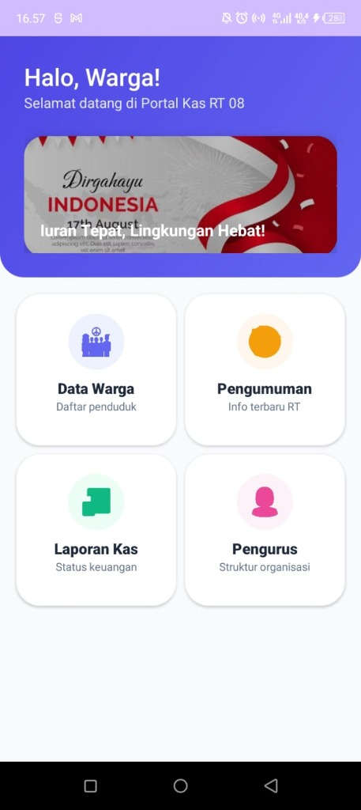
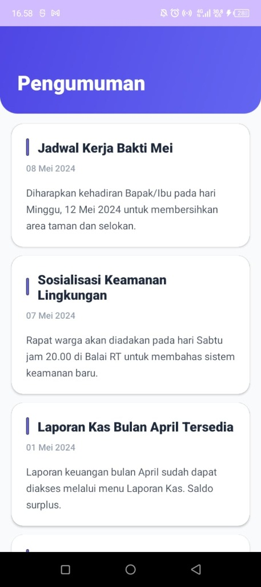
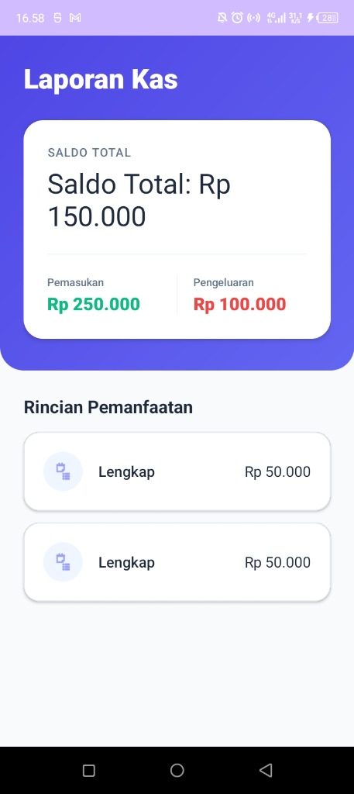
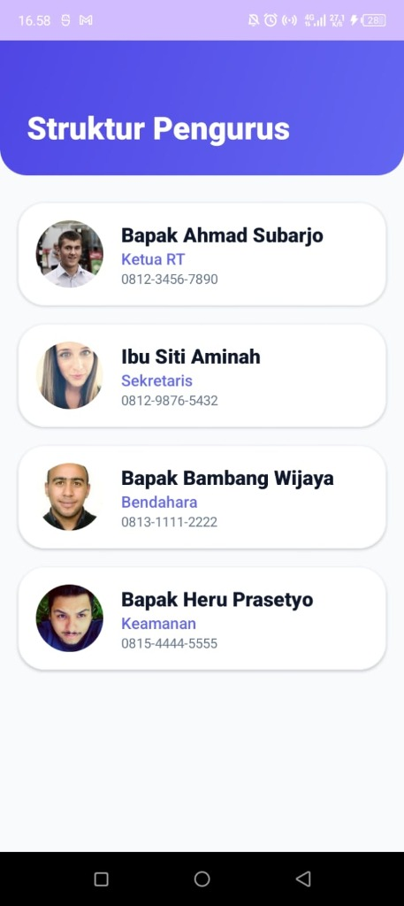

# KasRT - Portal Digital Warga RT 08

KasRT adalah aplikasi Android modern yang dirancang untuk mendigitalkan pengelolaan data dan keuangan di lingkungan Rukun Tetangga (RT). Aplikasi ini memberikan kemudahan bagi pengurus dalam mengelola iuran dan memfasilitasi warga untuk mendapatkan informasi terbaru secara real-time.

## 🚀 Fitur Utama

- **Dashboard Modern**: Tampilan antarmuka yang bersih dan premium menggunakan **Material 3 Design** dengan tema warna Indigo & Slate.
- **Data Warga**: Manajemen daftar penduduk yang terstruktur, mencakup informasi alamat dan status iuran.
- **Laporan Kas Real-time**: Transparansi keuangan RT yang dapat dipantau langsung oleh warga, mencakup total iuran dan detail pemanfaatan dana.
- **Pengumuman (Info Terbaru)**: Sistem informasi terpusat untuk kegiatan kerja bakti, rapat warga, dan informasi penting lainnya dengan indikator kategori (Info, Peringatan, Sukses).
- **Struktur Organisasi**: Menampilkan profil pengurus RT (Ketua, Sekretaris, Bendahara) untuk memudahkan koordinasi antar warga.

## 📸 Visual Tampilan

| Dashboard Utama | Data Warga | Pengumuman |
| :---: | :---: | :---: |
|  |  |  |

| Laporan Kas | Struktur Pengurus |
| :---: | :---: |
|  |  |

## 🛠️ Teknologi yang Digunakan

- **Bahasa**: [Kotlin](https://kotlinlang.org/)
- **Database**: [Firebase Realtime Database](https://firebase.google.com/products/realtime-database)
- **UI Framework**: Material Design 3 (M3)
- **Library Pendukung**:
  - Glide (Image Loading)
  - Firebase SDK
  - RecyclerView & CoordinatorLayout

## 📂 Struktur Proyek

- `/app/src/main/java/com/example/kasrt`: Berisi logika utama aplikasi (Activity, Adapter, Model).
- `/app/src/main/res/layout`: Definisi antarmuka pengguna (XML).
- `SeedData.kt`: Skrip otomatisasi untuk inisialisasi data awal ke Firebase.
- `FirebaseRepository.kt`: Layer akses data terpusat untuk komunikasi dengan Firebase.

## ⚙️ Cara Menjalankan

1. Clone repositori ini.
2. Buka proyek di **Android Studio (Koala atau versi lebih baru)**.
3. Hubungkan dengan project Firebase Anda (atau gunakan konfigurasi default yang sudah tersedia).
4. Jalankan aplikasi pada Emulator atau Perangkat Fisik.
5. Jika data kosong, aplikasi akan otomatis menjalankan `uploadSampleData()` untuk mengisi data demonstrasi.

---

**KasRT** - *Iuran Tepat, Lingkungan Hebat!*
